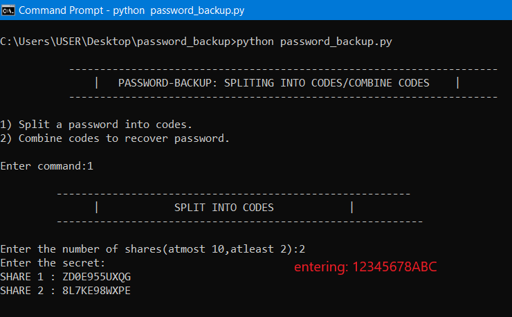
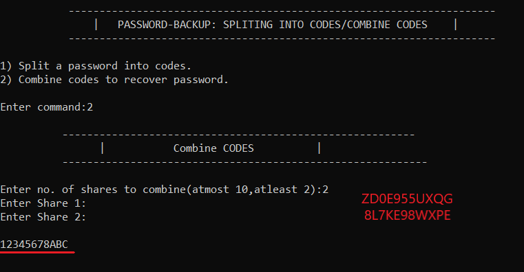

# Offline-password-Backup
A python program that splits your password into some codes which can combine later to restore the password

# Prerequisite
Python 3 installed and no other modules required

# How To Use
Open cmd and type "python password_backup.py" to run the code

Enter 1 to split your password into codes
  enter number of splited codes
  
  enter your password(on cmd it will not be visible but its there)
  
  save the splited codes for later to restore your password
  
 
 

Enter 2 to combine your codes
  enter number of splited codes
  
  enter your splited codes(on cmd it will not be visible but its there)
  
  your password is shown.
  
  
  
  
  # Application 
  
  You can store the split codes in a text file and use them later to restore your password.
